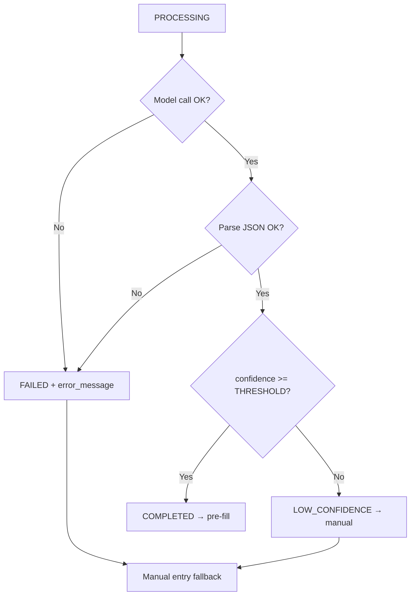

# OpsFlow — AI Pipeline

> **Status:** Approved for MVP build
> **Model:** Kimi-K2.6 Vision via **NVIDIA Build APIs**
> **Last updated:** 2026-06-12
> **Related docs:** [PRODUCT_REQUIREMENTS.md](./PRODUCT_REQUIREMENTS.md) · [DATABASE.md](./DATABASE.md) · [WORKFLOWS.md](./WORKFLOWS.md) · [API_DESIGN.md](./API_DESIGN.md)

---

## 1. Purpose

The AI Expense Intelligence Engine reads an uploaded receipt/invoice and extracts
structured expense data — **vendor, amount, date, payment method, category** — plus
a **confidence score**, so employees don't re-key data and HR reviews faster.

The model is **Kimi-K2.6 Vision**, accessed through **NVIDIA Build APIs**.
Processing is **asynchronous** and **non-blocking**; the confidence score is
**advisory only** — HR always makes the final approval decision.

---

## 2. Pipeline Overview

```
Employee uploads receipt/invoice
        ↓
Validate (type: PDF/PNG/JPG/JPEG, size <= 10 MB)
        ↓
Store original privately in Firebase Cloud Storage
        ↓
Create expenses row (status = DRAFT)
Create expense_analysis row (ai_status = PENDING)
        ↓
API responds immediately  ──────────────►  client polls /analysis
        ↓ (background)
Background AI worker picks up job → ai_status = PROCESSING
        ↓
Fetch file → send to Kimi-K2.6 Vision (NVIDIA Build)
        ↓
Document understanding → information extraction
        ↓
Structured JSON generated
        ↓
Persist to expense_analysis (vendor, amount, date, category,
payment_method, confidence_score, raw_output) + set ai_status
        ↓
Employee reviews / corrects → submits → HR review
```

See the state machines in [WORKFLOWS.md](./WORKFLOWS.md) §6.

---

## 3. Asynchronous Processing Strategy

**Decision:** AI runs asynchronously because vision inference can take several
seconds and must never block the API request or the user's interaction.

**MVP implementation:** a **simple, lightweight in-process background mechanism**
— e.g. an async job dispatched after the upload transaction commits (such as a
fire-and-forget worker function or an in-process queue polling the
`expense_analysis` table for `ai_status = PENDING`).

> **Explicitly out of scope for MVP:** Redis / BullMQ or any external
> message-queue infrastructure. These are documented as a future scaling option
> in §10.

### 3.1 Job lifecycle

1. Upload handler stores the file, creates `expenses (DRAFT)` and
   `expense_analysis (PENDING)`, returns `201`.
2. Background worker selects the next `PENDING` analysis, sets `PROCESSING`.
3. Worker downloads the file from Firebase and calls Kimi-K2.6 Vision.
4. Worker writes results and sets terminal `ai_status`
   (`COMPLETED` / `LOW_CONFIDENCE` / `FAILED`).
5. Client polling `GET /api/expenses/:id/analysis` observes the terminal state.

### 3.2 Idempotency & retries
- Each analysis is keyed 1:1 to an expense (`uq_analysis_expense`).
- A transient failure may be retried a bounded number of times before being
  marked `FAILED`; `error_message` captures the cause.
- `POST /api/expenses/:id/reprocess` resets the row to `PENDING` for a fresh run.

---

## 4. Model Invocation (Kimi-K2.6 Vision via NVIDIA Build)

- **Endpoint/credentials:** NVIDIA Build API base URL + API key are read from
  **environment variables only** (never committed; see [API_DESIGN.md](./API_DESIGN.md) §10).
- **Input:** the receipt/invoice (image or PDF page) plus a strict extraction
  prompt instructing the model to return **JSON only**.
- **Output contract:** a single JSON object (schema in §5).
- **Model version** recorded on every row as `expense_analysis.model_version`
  (`kimi-k2.6-vision`) for traceability.

### 4.1 Extraction prompt (intent)

The prompt instructs the model to:
- Identify the **vendor/merchant** name.
- Extract the **total amount** as a number (no currency symbol).
- Extract the **transaction date** in `YYYY-MM-DD`.
- Identify the **payment method** (e.g., UPI, CARD, CASH, NETBANKING).
- Classify the **expense category** (e.g., Software, Travel, Meals, Hardware, Office).
- Return a **confidence score** (0–100) reflecting overall extraction certainty.
- Return **strict JSON** with no prose, using `null` for any field it cannot read.

---

## 5. Structured Output Schema

The model must return exactly this shape; it is persisted into `expense_analysis`.

```json
{
  "vendor": "Amazon",
  "amount": 1450,
  "date": "2026-06-15",
  "category": "Software",
  "payment_method": "UPI",
  "confidence_score": 96
}
```

| Field | Type | Maps to | Notes |
|---|---|---|---|
| `vendor` | string\|null | `expense_analysis.vendor` | Merchant name |
| `amount` | number\|null | `expense_analysis.amount` | Total, numeric |
| `date` | string\|null | `expense_analysis.date` | `YYYY-MM-DD` |
| `category` | string\|null | `expense_analysis.category` | Classified category |
| `payment_method` | string\|null | `expense_analysis.payment_method` | UPI/CARD/CASH/… |
| `confidence_score` | integer | `expense_analysis.confidence_score` | 0–100, advisory |

The complete model response is also stored verbatim in
`expense_analysis.raw_output` (JSON) for audit and debugging.

---

## 6. Confidence & Status Mapping

After a successful model call, the worker maps the result to `ai_status`:

| Condition | `ai_status` | Downstream behavior |
|---|---|---|
| Parsed OK and `confidence_score >= THRESHOLD` | `COMPLETED` | Fields pre-fill employee form |
| Parsed OK and `confidence_score < THRESHOLD` | `LOW_CONFIDENCE` | Fall back to manual entry (fields shown as hints) |
| Model/network error or unparseable output | `FAILED` | Fall back to manual entry; `error_message` set |

- **`THRESHOLD`** is a configurable value (e.g. 70) held in environment config.
- **Confidence is advisory only.** It never auto-approves, auto-rejects, or skips
  human review. HR always decides (see [WORKFLOWS.md](./WORKFLOWS.md) §7).



---

## 7. Failure Handling & Fallback

- The employee can **always** complete the expense manually, regardless of AI
  outcome. AI is an accelerator, not a dependency.
- `FAILED` / `LOW_CONFIDENCE` surface a clear UI prompt to fill fields by hand.
- `reprocess` lets the employee (or HR) retry extraction.
- The original document remains the **source of truth**; OpsFlow never generates
  or stores a separate "analysis PDF".

---

## 8. Data Boundaries (what is stored where)

| Data | Location |
|---|---|
| Original receipt/invoice file | **Firebase Storage** (private; no public URL) |
| Raw AI extraction + confidence + full model JSON | **`expense_analysis`** (MySQL) |
| Employee-confirmed / HR-approved values | **`expenses`** (MySQL) |

See [DATABASE.md](./DATABASE.md) §5 (Storage Architecture).

---

## 9. Security & Privacy

- NVIDIA Build API key, Firebase service-account credentials, and JWT secret live
  in **environment variables only**.
- The worker fetches the file via the backend's Firebase credentials and sends it
  to NVIDIA Build over HTTPS; the file is never made public.
- Only structured, non-binary AI output is stored in the database.
- Access to analysis is RBAC + ownership scoped (owner, HR, Admin) — see
  [API_DESIGN.md](./API_DESIGN.md) §10.

---

## 10. AI Benefits

- Reduced manual data entry for employees.
- Faster expense processing and approval cycles.
- Higher accuracy and consistent categorization.
- Better-quality data feeding analytics.

---

## 11. Future Enhancements (out of MVP)

- External durable queue (Redis/BullMQ) for higher throughput and retries.
- Duplicate-receipt detection (e.g., file hashing) before/after extraction.
- Multi-currency normalization and tax/line-item extraction.
- Confidence-calibration tuning and per-category accuracy tracking.
- Audit logging of every AI action (via the future `activity_logs` table).
