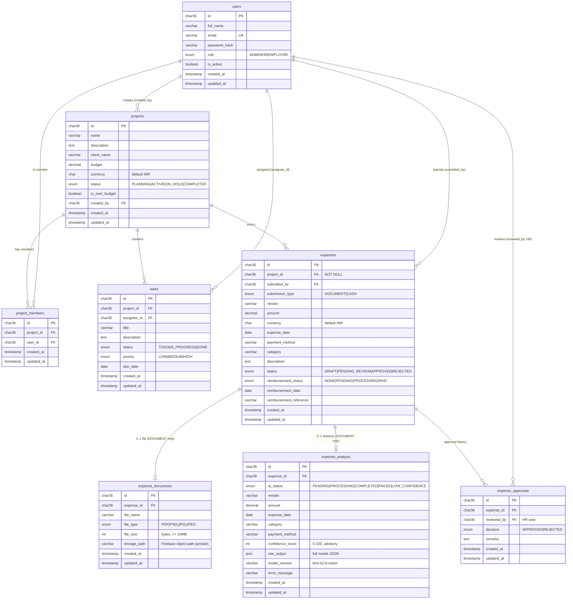

# OpsFlow — Database Design

> **Status:** Approved for MVP build
> **Database:** MySQL 8.x
> **Last updated:** 2026-06-12
> **Related docs:** [PRODUCT_REQUIREMENTS.md](./PRODUCT_REQUIREMENTS.md) · [WORKFLOWS.md](./WORKFLOWS.md) · [API_DESIGN.md](./API_DESIGN.md) · [AI_PIPELINE.md](./AI_PIPELINE.md)

---

## 1. Design Principles

- **Single organization.** No `tenant_id`, `organization_id`, or workspace columns.
  All rows belong to one company.
- **Exactly 8 tables.** No `reimbursements`, `audit_logs`, or `notifications`
  tables in the MVP. Reimbursement state lives on `expenses`.
- **UUID primary keys** on every table.
- **Timestamps everywhere.** Every table has `created_at` and `updated_at`.
- **Source-of-truth split for expenses:**
  - `expense_documents` — original file (reference only; file lives in Firebase). **One document per expense (MVP)**, present only for `DOCUMENT` expenses.
  - `expense_analysis` — **raw AI output** from Kimi-K2.6 Vision. Created **only for `DOCUMENT` expenses**; `CASH` expenses have no analysis row.
  - `expenses` — **employee-confirmed / HR-approved** values (the truth of record).
- **Every expense belongs to a project** (`expenses.project_id` is `NOT NULL`).
- **Approval history:** an expense may be rejected, corrected, and resubmitted, so
  `expense_approvals` keeps **many decision rows per expense** (no 1:1 constraint).
- **Files stored privately in Firebase Storage**; the DB stores only the storage
  path / reference. No public URLs.

### 1.1 UUID storage convention

PKs and FKs use `CHAR(36)` storing canonical UUID strings (e.g.
`9f1c0e2a-...`). UUIDs are generated by the application layer.

> **Recommendation:** generate **UUIDv7** (time-ordered) in the app to keep
> InnoDB's clustered index append-friendly and avoid page-split overhead from
> random UUIDv4. Storage type stays `CHAR(36)` for readability and tooling
> compatibility.

### 1.2 Conventions

- `created_at TIMESTAMP DEFAULT CURRENT_TIMESTAMP`
- `updated_at TIMESTAMP DEFAULT CURRENT_TIMESTAMP ON UPDATE CURRENT_TIMESTAMP`
- ENUMs are uppercase and match the values used in [API_DESIGN.md](./API_DESIGN.md).
- All money columns are `DECIMAL(14,2)`. Currency is a 3-letter ISO code, default `INR`.

---

## 2. Entity-Relationship Overview



---

## 3. Table Definitions (DDL)

### 3.1 `users`

Stores Admin, HR, and Employee accounts.

```sql
CREATE TABLE users (
  id            CHAR(36)     NOT NULL,
  full_name     VARCHAR(150) NOT NULL,
  email         VARCHAR(255) NOT NULL,
  password_hash VARCHAR(255) NOT NULL,            -- bcrypt/argon2 hash
  role          ENUM('ADMIN','HR','EMPLOYEE') NOT NULL DEFAULT 'EMPLOYEE',
  is_active     BOOLEAN      NOT NULL DEFAULT TRUE,
  created_at    TIMESTAMP    NOT NULL DEFAULT CURRENT_TIMESTAMP,
  updated_at    TIMESTAMP    NOT NULL DEFAULT CURRENT_TIMESTAMP ON UPDATE CURRENT_TIMESTAMP,
  PRIMARY KEY (id),
  UNIQUE KEY uq_users_email (email)
) ENGINE=InnoDB DEFAULT CHARSET=utf8mb4;
```

### 3.2 `projects`

```sql
CREATE TABLE projects (
  id             CHAR(36)      NOT NULL,
  name           VARCHAR(200)  NOT NULL,
  description    TEXT          NULL,
  client_name    VARCHAR(200)  NULL,
  budget         DECIMAL(14,2) NOT NULL DEFAULT 0.00,
  currency       CHAR(3)       NOT NULL DEFAULT 'INR',
  status         ENUM('PLANNING','ACTIVE','ON_HOLD','COMPLETED') NOT NULL DEFAULT 'PLANNING',
  is_over_budget BOOLEAN       NOT NULL DEFAULT FALSE,  -- flag set when approved spend > budget
  created_by     CHAR(36)      NOT NULL,
  created_at     TIMESTAMP     NOT NULL DEFAULT CURRENT_TIMESTAMP,
  updated_at     TIMESTAMP     NOT NULL DEFAULT CURRENT_TIMESTAMP ON UPDATE CURRENT_TIMESTAMP,
  PRIMARY KEY (id),
  KEY idx_projects_status (status),
  CONSTRAINT fk_projects_created_by FOREIGN KEY (created_by) REFERENCES users (id)
) ENGINE=InnoDB DEFAULT CHARSET=utf8mb4;
```

> **Budget overrun:** approvals are never blocked. When approved spend exceeds
> `budget`, the application sets `is_over_budget = TRUE` and the UI shows a
> warning. Computed utilization is derived at query time from APPROVED expenses.

### 3.3 `project_members`

Maps employees to projects (many-to-many). Drives Employee ownership checks for
projects.

```sql
CREATE TABLE project_members (
  id         CHAR(36)  NOT NULL,
  project_id CHAR(36)  NOT NULL,
  user_id    CHAR(36)  NOT NULL,
  created_at TIMESTAMP NOT NULL DEFAULT CURRENT_TIMESTAMP,
  updated_at TIMESTAMP NOT NULL DEFAULT CURRENT_TIMESTAMP ON UPDATE CURRENT_TIMESTAMP,
  PRIMARY KEY (id),
  UNIQUE KEY uq_member (project_id, user_id),
  KEY idx_member_user (user_id),
  CONSTRAINT fk_member_project FOREIGN KEY (project_id) REFERENCES projects (id) ON DELETE CASCADE,
  CONSTRAINT fk_member_user    FOREIGN KEY (user_id)    REFERENCES users (id)    ON DELETE CASCADE
) ENGINE=InnoDB DEFAULT CHARSET=utf8mb4;
```

### 3.4 `tasks`

```sql
CREATE TABLE tasks (
  id          CHAR(36)     NOT NULL,
  project_id  CHAR(36)     NOT NULL,
  assignee_id CHAR(36)     NULL,
  title       VARCHAR(200) NOT NULL,
  description TEXT         NULL,
  status      ENUM('TODO','IN_PROGRESS','DONE') NOT NULL DEFAULT 'TODO',
  priority    ENUM('LOW','MEDIUM','HIGH')       NOT NULL DEFAULT 'MEDIUM',
  due_date    DATE         NULL,
  created_at  TIMESTAMP    NOT NULL DEFAULT CURRENT_TIMESTAMP,
  updated_at  TIMESTAMP    NOT NULL DEFAULT CURRENT_TIMESTAMP ON UPDATE CURRENT_TIMESTAMP,
  PRIMARY KEY (id),
  KEY idx_tasks_project (project_id),
  KEY idx_tasks_assignee (assignee_id),
  KEY idx_tasks_status (status),
  CONSTRAINT fk_tasks_project  FOREIGN KEY (project_id)  REFERENCES projects (id) ON DELETE CASCADE,
  CONSTRAINT fk_tasks_assignee FOREIGN KEY (assignee_id) REFERENCES users (id)    ON DELETE SET NULL
) ENGINE=InnoDB DEFAULT CHARSET=utf8mb4;
```

> **Assignee must be a project member:** the application validates that
> `assignee_id` exists in `project_members(project_id, user_id)` on task
> create/update. (Not expressible as a single-table FK; enforced in the service layer.)

### 3.5 `expenses`

Holds the **employee-confirmed / HR-approved** values (source of truth).
Reimbursement is tracked here (no separate table).

```sql
CREATE TABLE expenses (
  id                       CHAR(36)      NOT NULL,
  project_id               CHAR(36)      NOT NULL,        -- every expense belongs to a project
  submitted_by             CHAR(36)      NOT NULL,        -- employee owner
  submission_type          ENUM('DOCUMENT','CASH') NOT NULL,
  vendor                   VARCHAR(200)  NULL,
  amount                   DECIMAL(14,2) NOT NULL DEFAULT 0.00,  -- must be > 0 at submit (app-enforced)
  currency                 CHAR(3)       NOT NULL DEFAULT 'INR',
  expense_date             DATE          NULL,
  payment_method           VARCHAR(50)   NULL,
  category                 VARCHAR(100)  NULL,
  description              TEXT          NULL,
  status                   ENUM('DRAFT','PENDING_REVIEW','APPROVED','REJECTED') NOT NULL DEFAULT 'DRAFT',
  reimbursement_status     ENUM('NONE','PENDING','PROCESSING','PAID') NOT NULL DEFAULT 'NONE',
  reimbursement_date       DATE          NULL,
  reimbursement_reference  VARCHAR(100)  NULL,
  created_at               TIMESTAMP     NOT NULL DEFAULT CURRENT_TIMESTAMP,
  updated_at               TIMESTAMP     NOT NULL DEFAULT CURRENT_TIMESTAMP ON UPDATE CURRENT_TIMESTAMP,
  PRIMARY KEY (id),
  KEY idx_expenses_project (project_id),
  KEY idx_expenses_owner (submitted_by),
  KEY idx_expenses_status (status),
  KEY idx_exp_owner_status (submitted_by, status),       -- employee "my expenses" filter
  KEY idx_exp_status_created (status, created_at),        -- HR review queue
  KEY idx_exp_reimb (status, reimbursement_status),       -- reimbursement list
  CONSTRAINT fk_expenses_project FOREIGN KEY (project_id)   REFERENCES projects (id) ON DELETE RESTRICT,
  CONSTRAINT fk_expenses_owner   FOREIGN KEY (submitted_by) REFERENCES users (id)
) ENGINE=InnoDB DEFAULT CHARSET=utf8mb4;
```

**Status lifecycle:** `DRAFT` (created; AI processing / employee reviewing) →
`PENDING_REVIEW` (submitted to HR) → `APPROVED` | `REJECTED`. A `REJECTED` expense
may be corrected and resubmitted (`REJECTED → DRAFT → PENDING_REVIEW`), producing a
new `expense_approvals` row each cycle. Only `APPROVED` expenses count toward
budgets, company records, analytics, and reimbursement eligibility. See
[WORKFLOWS.md](./WORKFLOWS.md).

**Reimbursement lifecycle:** starts `NONE`; set to `PENDING` by the system when the
expense is `APPROVED`; then HR moves it `PROCESSING → PAID`.

### 3.6 `expense_documents`

File metadata only — the actual file lives in Firebase Storage (private).
**One document per expense (MVP)** — enforced by a unique key on `expense_id`.

```sql
CREATE TABLE expense_documents (
  id           CHAR(36)     NOT NULL,
  expense_id   CHAR(36)     NOT NULL,
  file_name    VARCHAR(255) NOT NULL,
  file_type    ENUM('PDF','PNG','JPG','JPEG') NOT NULL,
  file_size    INT          NOT NULL,                  -- bytes; app enforces <= 10MB
  storage_path VARCHAR(500) NOT NULL,                  -- Firebase object path (no public URL)
  created_at   TIMESTAMP    NOT NULL DEFAULT CURRENT_TIMESTAMP,
  updated_at   TIMESTAMP    NOT NULL DEFAULT CURRENT_TIMESTAMP ON UPDATE CURRENT_TIMESTAMP,
  PRIMARY KEY (id),
  UNIQUE KEY uq_doc_expense (expense_id),               -- one document per expense (MVP)
  CONSTRAINT fk_doc_expense FOREIGN KEY (expense_id) REFERENCES expenses (id) ON DELETE CASCADE
) ENGINE=InnoDB DEFAULT CHARSET=utf8mb4;
```

> Access to files is via **short-lived signed URLs** generated on demand by the
> backend. `storage_path` is never exposed directly to clients as a public URL.

### 3.7 `expense_analysis`

Stores the **raw AI extraction** from Kimi-K2.6 Vision. Created **only for
`DOCUMENT` expenses** — `CASH` expenses have no analysis row. At most one analysis
per expense (`uq_analysis_expense`).

```sql
CREATE TABLE expense_analysis (
  id               CHAR(36)      NOT NULL,
  expense_id       CHAR(36)      NOT NULL,
  ai_status        ENUM('PENDING','PROCESSING','COMPLETED','FAILED','LOW_CONFIDENCE')
                                 NOT NULL DEFAULT 'PENDING',
  vendor           VARCHAR(200)  NULL,
  amount           DECIMAL(14,2) NULL,
  expense_date     DATE          NULL,
  category         VARCHAR(100)  NULL,
  payment_method   VARCHAR(50)   NULL,
  confidence_score INT           NULL,                 -- 0-100, advisory only
  raw_output       JSON          NULL,                 -- full structured model response
  model_version    VARCHAR(100)  NOT NULL DEFAULT 'kimi-k2.6-vision',
  error_message    VARCHAR(500)  NULL,                 -- populated when ai_status=FAILED
  created_at       TIMESTAMP     NOT NULL DEFAULT CURRENT_TIMESTAMP,
  updated_at       TIMESTAMP     NOT NULL DEFAULT CURRENT_TIMESTAMP ON UPDATE CURRENT_TIMESTAMP,
  PRIMARY KEY (id),
  UNIQUE KEY uq_analysis_expense (expense_id),
  KEY idx_analysis_status (ai_status),
  CONSTRAINT fk_analysis_expense FOREIGN KEY (expense_id) REFERENCES expenses (id) ON DELETE CASCADE
) ENGINE=InnoDB DEFAULT CHARSET=utf8mb4;
```

**`ai_status` semantics**
- `PENDING` — analysis row created; awaiting background processing.
- `PROCESSING` — background job is calling Kimi-K2.6 Vision.
- `COMPLETED` — extraction succeeded with acceptable confidence.
- `LOW_CONFIDENCE` — extraction returned but confidence below threshold → employee fills/corrects manually.
- `FAILED` — model/network error → fallback to manual entry; `error_message` set.

Confidence is **advisory**: it never auto-approves or auto-rejects. See
[AI_PIPELINE.md](./AI_PIPELINE.md).

### 3.8 `expense_approvals`

HR decision **history** — one row per decision, so reject → resubmit → approve
cycles are all retained (no 1:1 constraint). The latest row reflects the current
decision.

```sql
CREATE TABLE expense_approvals (
  id          CHAR(36)  NOT NULL,
  expense_id  CHAR(36)  NOT NULL,
  reviewed_by CHAR(36)  NOT NULL,                       -- HR user
  decision    ENUM('APPROVED','REJECTED') NOT NULL,
  remarks     TEXT      NULL,                            -- required when REJECTED (app-enforced)
  created_at  TIMESTAMP NOT NULL DEFAULT CURRENT_TIMESTAMP,  -- acts as reviewed_at
  updated_at  TIMESTAMP NOT NULL DEFAULT CURRENT_TIMESTAMP ON UPDATE CURRENT_TIMESTAMP,
  PRIMARY KEY (id),
  KEY idx_approval_expense (expense_id),                 -- history lookup (no unique)
  KEY idx_approval_expense_created (expense_id, created_at),
  KEY idx_approval_reviewer (reviewed_by),
  CONSTRAINT fk_approval_expense  FOREIGN KEY (expense_id)  REFERENCES expenses (id) ON DELETE CASCADE,
  CONSTRAINT fk_approval_reviewer FOREIGN KEY (reviewed_by) REFERENCES users (id)
) ENGINE=InnoDB DEFAULT CHARSET=utf8mb4;
```

---

## 4. Relationships Summary

| Relationship | Type | Notes |
|---|---|---|
| users → projects | 1-to-many | `projects.created_by` |
| users ↔ projects | many-to-many | via `project_members` |
| projects → tasks | 1-to-many | `tasks.project_id` |
| users → tasks | 1-to-many | `tasks.assignee_id` (nullable) |
| projects → expenses | 1-to-many | `expenses.project_id` (**NOT NULL**) |
| users → expenses | 1-to-many | `expenses.submitted_by` |
| expenses → expense_documents | 1-to-(0..1) | one document per expense; DOCUMENT type only |
| expenses → expense_analysis | 1-to-(0..1) | one analysis; DOCUMENT type only |
| expenses → expense_approvals | 1-to-many | approval history (reject/resubmit cycles) |
| users → expense_approvals | 1-to-many | `reviewed_by` (HR) |

---

## 5. Storage Architecture

| Store | Holds |
|---|---|
| **MySQL** | users, projects, project_members, tasks, expenses, expense_documents (metadata), expense_analysis (AI output), expense_approvals |
| **Firebase Storage** | Original receipts / invoices / PDFs (private objects) |

- The database stores **only file references** (`storage_path`) — never the binary.
- **No public URLs.** Downloads use backend-generated, short-lived signed URLs.
- The **original document is the source of truth** for the receipt; OpsFlow does
  not generate or store separate analysis PDFs.
- Structured AI output (`expense_analysis`) is used for employee review, HR
  approval, and analytics.

---

## 6. Derived Values (computed, not stored as separate tables)

- **Project spend** = SUM(`expenses.amount`) WHERE `status='APPROVED'` AND `project_id = ?`.
- **Budget utilization** = project spend / `projects.budget`.
- **Over-budget flag** = `projects.is_over_budget` is **recomputed** (set or cleared)
  on every expense approval and on project-budget edits: `TRUE` when spend > budget,
  else `FALSE`. It is never left stale.
- **Reimbursement tracking** = `expenses.reimbursement_status/date/reference`
  (`NONE` until the expense is `APPROVED`).

---

## 7. Future Schema Additions (out of MVP)

- `activity_logs` — audit trail of state changes and AI actions.
- `notifications` — user-facing event delivery.
- `reimbursements` — dedicated table if reimbursement grows beyond 3 fields.
- Duplicate-detection columns (e.g., `file_hash`) on `expense_documents`.
