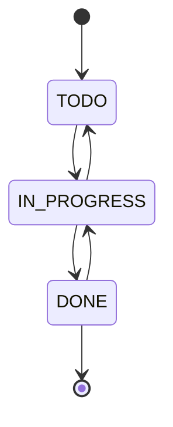
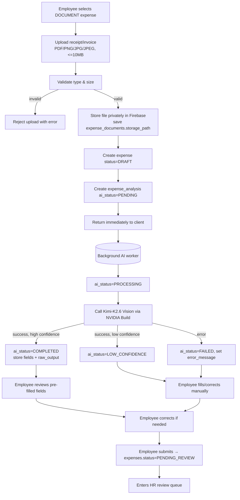
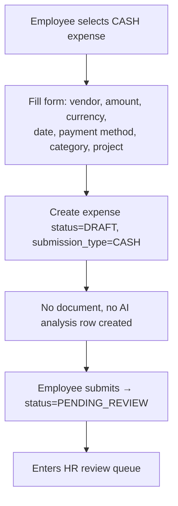
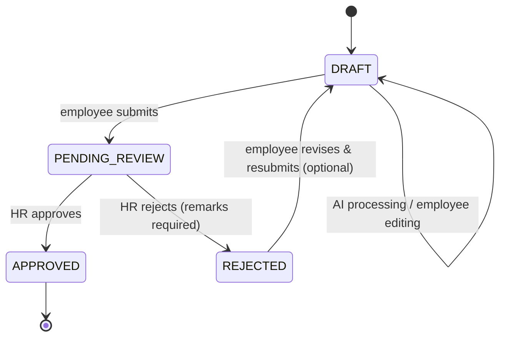
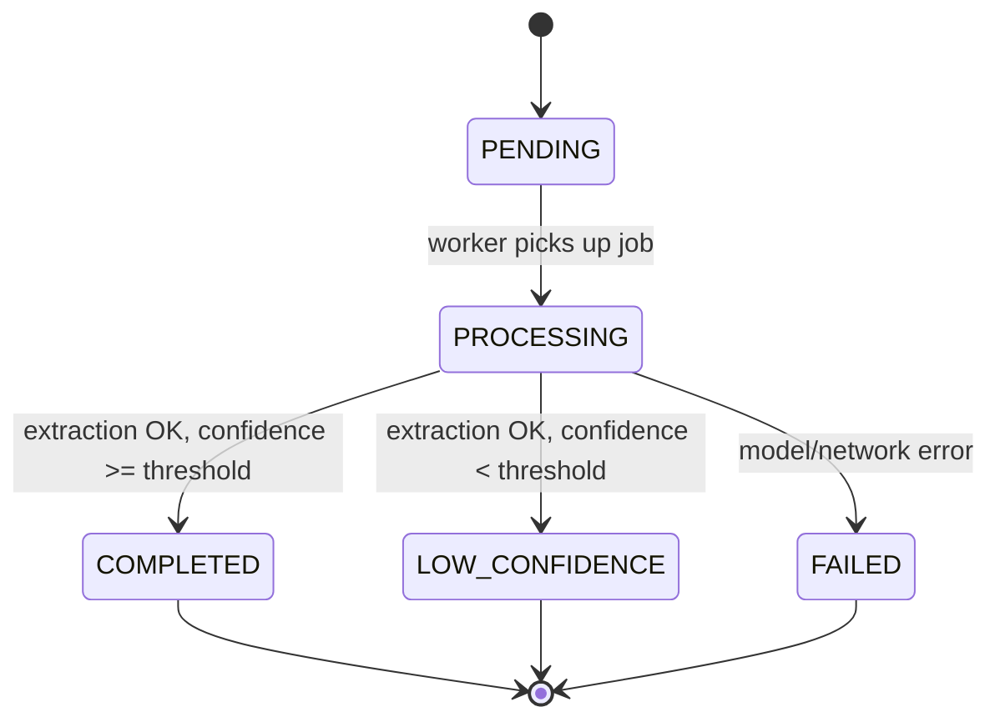
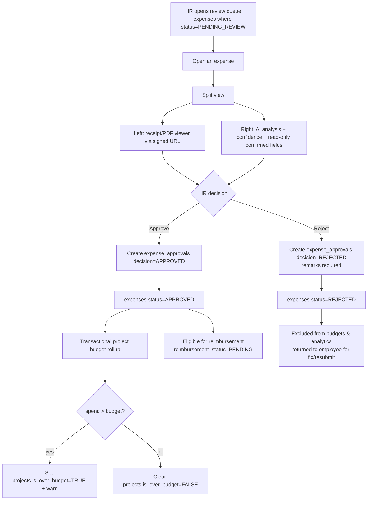
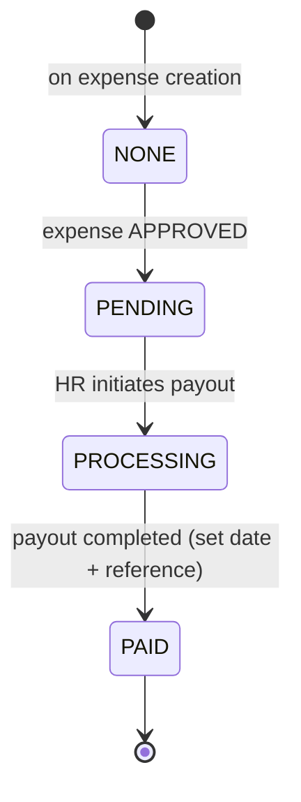
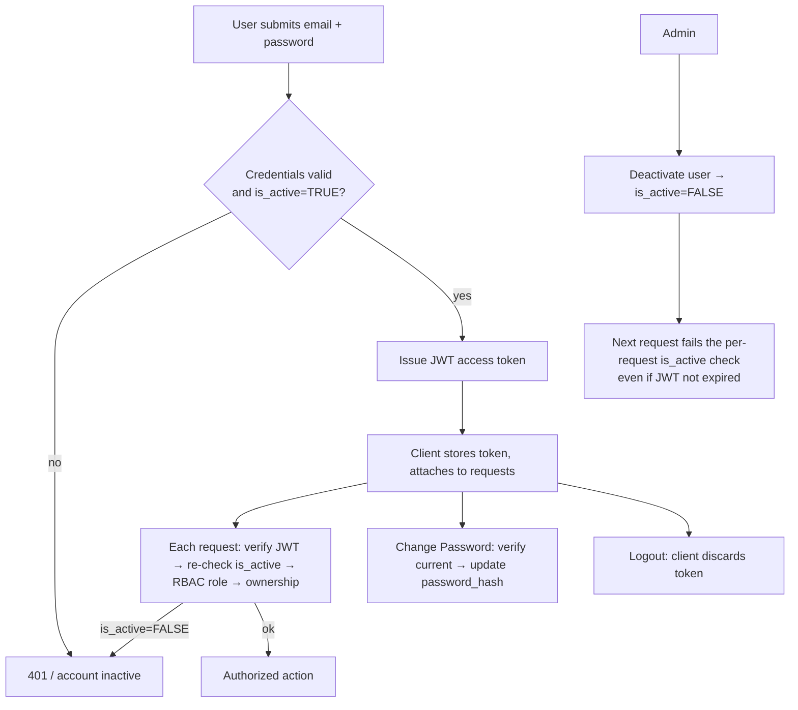

# OpsFlow — Workflows

> **Status:** Approved for MVP build
> **Last updated:** 2026-06-12
> **Related docs:** [PRODUCT_REQUIREMENTS.md](./PRODUCT_REQUIREMENTS.md) · [DATABASE.md](./DATABASE.md) · [API_DESIGN.md](./API_DESIGN.md) · [AI_PIPELINE.md](./AI_PIPELINE.md)

This document describes the operational flows in OpsFlow and the exact state
transitions each entity goes through. All states map to the ENUMs defined in
[DATABASE.md](./DATABASE.md).

---

## 1. Roles in Workflows

| Role | Workflow involvement |
|---|---|
| **ADMIN** | Creates projects, assigns members, creates/assigns tasks, manages budgets, views analytics |
| **EMPLOYEE** | Works tasks, submits expenses, reviews/corrects AI output, tracks reimbursements |
| **HR** | Reviews submitted expenses, approves/rejects, manages reimbursement status |

Access at every step is enforced by **RBAC + ownership** (an Employee only acts on
their own tasks/expenses and projects they belong to).

---

## 2. High-Level System Flow

```
ADMIN
  └─ Create Project → Assign Employees → Create & Assign Tasks

EMPLOYEE
  └─ View Assigned Tasks → Update Status → Submit Expenses

EXPENSE (document-based)
  └─ Upload → Firebase Storage → Kimi-K2.6 Vision (async)
       → AI Analysis → Employee Review/Correct → Submit

HR
  └─ Review Queue → Inspect Receipt + AI Analysis → Approve / Reject

APPROVED EXPENSE
  └─ Project Budget Rollup → Company Records → Analytics → Reimbursement
```

---

## 3. Project & Task Workflow

### 3.1 Project lifecycle

```
PLANNING → ACTIVE → ON_HOLD ↔ ACTIVE → COMPLETED
```

1. **Admin** creates a project (name, client, budget, currency, status).
2. **Admin** assigns employees via `project_members`.
3. Project detail aggregates members, tasks, expenses, and budget utilization.
4. As APPROVED expenses accumulate, spend is rolled up; if spend > budget the
   project is **flagged** `is_over_budget = TRUE` (a warning, never a block).

### 3.2 Task lifecycle (Kanban)

```
TODO → IN_PROGRESS → DONE
```



- **Admin** creates and assigns tasks (title, description, assignee, priority, due date).
- **Assignee (Employee)** moves their own task across statuses.
- Employees see **only** tasks assigned to them.

---

## 4. Expense Submission Workflows

There are two submission types. Both end in HR review.

### 4.1 Document-based expense (AI-assisted)



Key points:
- **Upload never blocks on AI.** The request returns as soon as the file is stored
  and records are created; extraction runs asynchronously. See
  [AI_PIPELINE.md](./AI_PIPELINE.md).
- On `COMPLETED`, extracted values pre-fill the employee form.
- On `LOW_CONFIDENCE` or `FAILED`, the system **falls back to manual entry**.
- The employee can edit **any** field before submitting (employee correction step).
- Confirmed values are written to `expenses`; raw AI output stays in `expense_analysis`.

### 4.2 Cash expense (manual)



- No document and no AI step. **No `expense_analysis` row is created** for CASH
  expenses. The AI endpoints (`/analysis`, `/reprocess`) return `404`/`409` for
  CASH and the AI UI is hidden.

---

## 5. Expense State Machine



| State | Meaning | Counts toward budgets/analytics? |
|---|---|---|
| `DRAFT` | Created; AI processing and/or employee reviewing/correcting | No |
| `PENDING_REVIEW` | Submitted; awaiting HR decision | No |
| `APPROVED` | HR approved | **Yes** |
| `REJECTED` | HR rejected with remarks | No |

**Resubmission & approval history:** a `REJECTED` expense can be corrected by the
employee and resubmitted (`REJECTED → DRAFT → PENDING_REVIEW`). Each HR decision
appends a new row to `expense_approvals`, preserving the full review history; the
latest row is the current decision.

---

## 6. AI Analysis State Machine (`expense_analysis.ai_status`)



- Applies to **`DOCUMENT` expenses only** — `CASH` expenses never create an analysis row.
- `COMPLETED` → fields pre-filled for employee review.
- `LOW_CONFIDENCE` / `FAILED` → manual entry fallback.
- `reprocess` is allowed only while the expense is `DRAFT` (resets analysis to `PENDING`).
- An employee may submit while analysis is still `PROCESSING` (AI is advisory); the
  UI warns that extraction is pending.
- Confidence score is **advisory**; it is shown to employee and HR but never
  drives an automatic approval/rejection.

---

## 7. HR Approval Workflow



Rules:
- Only HR can approve/reject. A rejection **requires remarks**. **HR cannot edit
  expense field values** — only the employee can, before submission.
- Each decision appends to `expense_approvals` (history); the latest row is current.
- Budget rollup runs in a **DB transaction** to keep spend/flag consistent under
  concurrent approvals; `is_over_budget` is **recomputed** (set or cleared) each time.
- Approval **never blocks** on budget; overage only raises a warning/flag.

---

## 8. Reimbursement Workflow (fields on `expenses`)

No separate table — tracked via `reimbursement_status`, `reimbursement_date`,
`reimbursement_reference`.



| Status | Set by | Side effects |
|---|---|---|
| `NONE` | System (default at creation) | Not yet eligible (DRAFT / PENDING_REVIEW / REJECTED) |
| `PENDING` | System (on APPROVED) | Expense eligible for reimbursement |
| `PROCESSING` | HR / ADMIN | Payout in progress |
| `PAID` | HR / ADMIN | `reimbursement_date` + `reimbursement_reference` recorded |

Only **APPROVED** expenses enter the reimbursement flow (`NONE → PENDING`).

---

## 9. Authentication Workflow



MVP includes: Login, Logout, JWT, RBAC, **per-request `is_active` re-check**, user
deactivation, change password. **Excluded:** refresh tokens, password reset.

**Bootstrap admin:** since there is no public registration, an initial ADMIN is
seeded from environment variables (`ADMIN_EMAIL`, `ADMIN_PASSWORD`) during initial
database setup. See [API_DESIGN.md](./API_DESIGN.md) and [DATABASE.md](./DATABASE.md).

---

## 10. Dashboard Data Flows (read-only)

| Dashboard | Sources |
|---|---|
| **Admin** | counts from `users`, `projects`; SUM of APPROVED `expenses`; budget utilization per project |
| **HR** | `expenses` grouped by status (pending/approved/rejected); review metrics from `expense_approvals` |
| **Employee** | own `tasks` (by status), own `expenses` (by status + reimbursement) |

All dashboard list queries support pagination, filtering, sorting, and search
(see [API_DESIGN.md](./API_DESIGN.md)).

---

## 11. End-to-End Happy Path (document expense)

1. Admin creates Project "Acme Portal" (budget ₹500,000) and assigns Employee A.
2. Admin creates Task "Build login page" assigned to Employee A.
3. Employee A buys software, uploads the invoice (PDF, 1.2 MB).
4. File stored privately in Firebase; `expenses` row `DRAFT`; `expense_analysis` `PENDING`.
5. Background worker → `PROCESSING` → Kimi-K2.6 Vision → `COMPLETED`
   (vendor "Amazon", ₹1,450, category "Software", UPI, confidence 96).
6. Employee A reviews pre-filled fields, fixes the category, submits → `PENDING_REVIEW`.
7. HR opens the expense, views the invoice + AI panel, approves.
8. `expenses.status = APPROVED`; project spend rolled up; reimbursement `PENDING`.
9. HR processes payout → `PROCESSING` → `PAID` with date + reference.
10. Admin analytics reflect the approved spend and budget utilization.
